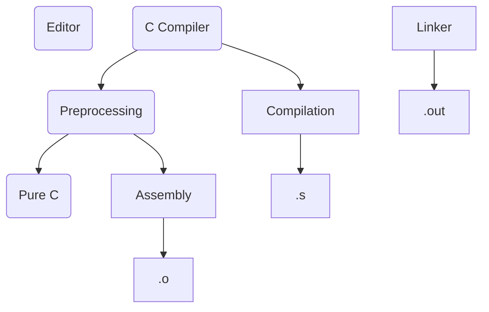

# RTES | 2025-01-03

- Unix script `.sh` not necessary?

- `arm-none-eabi-gcc`
  - `-c`
    - Only compile, don't link
  - `-E`
  - `-S`

- Makefiles

  - Dependency management

  - ~Delta compilation

