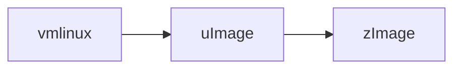

# RTES | 2025-04-08

## Embedded Linux system

- Secondary devices
  - Almost always there, if not there then have some large RAM, etc
- Memory mapped unit (MMU)
- TI Sitara processors (?)
- Broadcom architecture in Raspberry Pi; Not open sourced (?)
- Static RAM
  - Implemented using transistors
- DRAM: Dynamic RAM
  - Implemented using capacitors
  - Problem is over time, discharging
  - A lot cheaper than SRAM
  - DDR3, etc

- Direct memory access (DMA)
- Storage
  - Partitioned, and each partition can be used as a file system
  - SD card; One example design
    - Partition table
      - First 128kB
    - MLO: Minimal loader
      - 128kB to 256 kB
      - No filesystem here, processor just dumps code from here for the pre-bootloader to get started
      - Processor reads MLO into RAM and runs
    - u-Boot
      - 384kB to 1152kB
      - MLO reads uBoot into RAM and runs
  - Processor has a small internal ROM
    - ~ Tightly integrated
  - DRAM needs to be programmed, varies from device to device
    - Charging cycle, wait time (?), etc

- `dd`: Disk dump
  - Write raw bytes on any I/O device
- Bootloader
- Build on one device, and deploy on a target
- Kernel / OS
  - Organised into API / System calls supported by the OS
  - Compile all into an executable `vmlinux`
  - Compressed, and so on
    - `vmlinuz`, etc

### SD card organisation

- MBR: 512 bytes
  - Master boot record
  - How many partitions are there in the hard drive
- Unused: 128kB
- MLO: 128kB
- Unused: 128kB
- uBoot: 768kB
- Unused: Till 4MB
  - Till here, raw bytes
- Partition 1: Till end
  - Formatted; Organised as a file system

- ~ `rootfs` starts from partition 1 (?)

### Boot up

- ROM bootloader

- Compressed images to save SD card space, at cost of increased boot up time

## Kernel execution

- Kernel
  - Process subsystem
  - Hierarchical file sytem
  - Network protocols
  - Device drivers
- Page frames
- `.../sbin/init`
  - Loads up applications, etc

- Processes
  - Kernel threads (?)
    - Threads running in kernel address space, in supervisor mode
  - Daemons
  - Service processes
  - Application process
    - Shells: BASH, ZSH, etc, are application processes

- Extended Berkeley Packet Filter (eBPF)
  - Networks (?)

## What is an operating system?

- An entity that manages resources
- Resources
  - CPU
    - Processes and threads
      - A system which provides processes and threads to manage CPU
    - Context switches happen in threads as well
    - Programming the MMU between processes switching
  - Memory
    - Memory allocation
    - Virtual memory management
    - RTOS: Does little bit of the above
  - IO
    - ~ For RTOS, this is mostly application space
  - Block devices for file system
    - Goes through file system layer; Translation
  - Char devices for I/O devices
    - ~ Raw inputs (?)
    - `tty`
    - Eg: UART
- ~ Flash/ROM to have initial bootloader
- Priviledges
  - Distinguishing application vs kernel processes
  - File system rights; Read, write, execute, etc
- ~ MMU controls page tables
  - ~ The moment we remove MMU from the picture, a lot of hacky things are not possible for applications to execute

## Process mode

- Hardware must have limited capabilities when running the applications
- Supervisor mode / Kernel mode
  - Full control to all processor resources
- User mode
  - Like a parental lock, kinda :))
  - Does not have access to
    - Certain registers (Eg: Processor mode)
    - Privileged instructions (Enabling/ Disabling interrupts)
    - MMU
      - Vector table
      - Physical memory and IO
  - Access violation exception generated, whenever something requests the above
    - MMU detects the violation
- Trap door
  - Need processor mode to simultaneously change when jumping to another subroutine, not before, not after
    - Some interrupt (?)
  - Linux implements system calls, with some standardised numbers
    - `_syscall`
    - Some 300/400 system calls
  - Call `SVCall` / `trap` => `SVC / trap handler`
  - Accessing hardware and peripherals
  - ~ Modify appropriate kernel data structures
  - And return back
- MMU, allows for isolation; Amazing
- Mostly all interrupts are in kernel mode
- Context switches, with re-programming the MMUs

### Operating system

- A set of exception handlers
  - SWIs for system calls
  - Exceptions for fault handling
  - Timer interrupts for scheduling
  - Hardware interrupts for device handling
  - Reset interrupt for powering ON

- ARM just has 2 interrupts; IRQ, FRQ
  - Interrupt handler
  - Fast handler
  - ~ Needs polling to know which device caused the interrupt
- `insmode`
  - Requires supervisor mode
  - Proprietory drivers, etc, are extensions, to OS
- Security, and priviledges are important at this level; The overheads are acceptable
- Even though Linux is not deterministic, the configuration can be, and with fast processors, can almost be reasonably real-time
- Analogy:
  - User fills a form, government handles it, sees if applicable, and returns with a stamp, to continue
- Linux
  - Everything is a file
  - `stdout` file
  - `printf` is in application space; Provided by libC
  - `write` is provided by kernel
    - 'stub' (?)
    - `do_write` in kernel (?)
  - Application doesn't need to know any of the kernel function addresses
    - Just needs to do syscall
    - Kernel knows what to do
    - Analogy: Filling a form 15H, organisation knows where to send, but the one filling need not

- Hack
  - Priviledge escalation
  - CIS benchmarks
  - Honey pots

---

